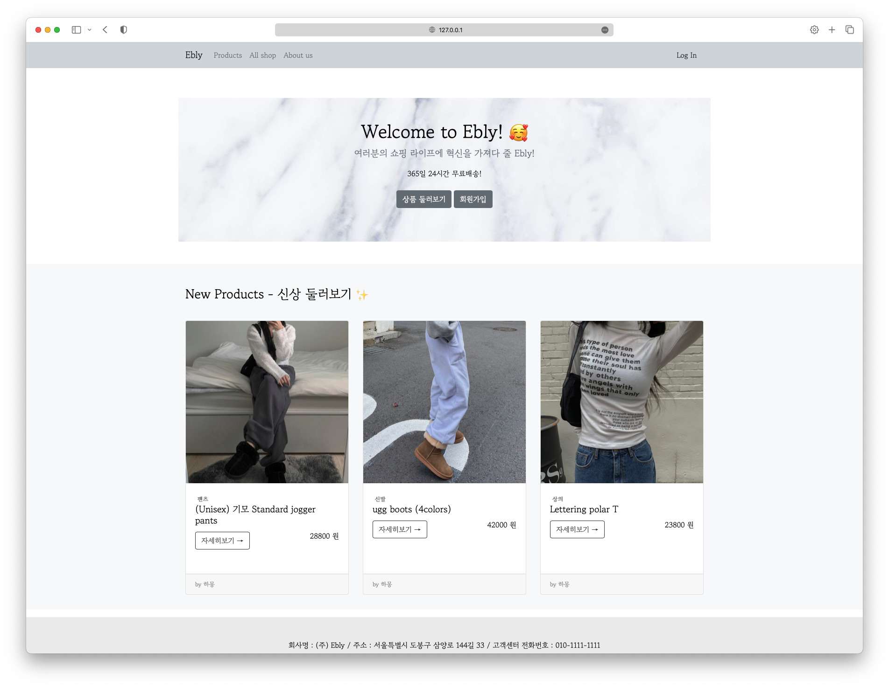
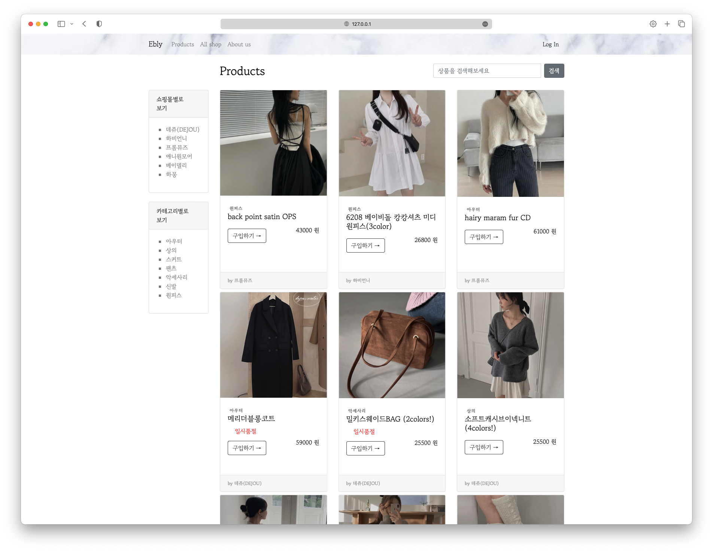
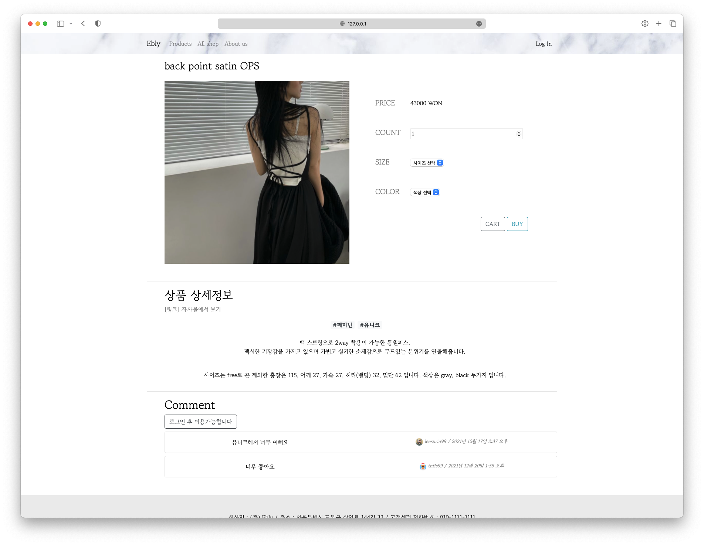
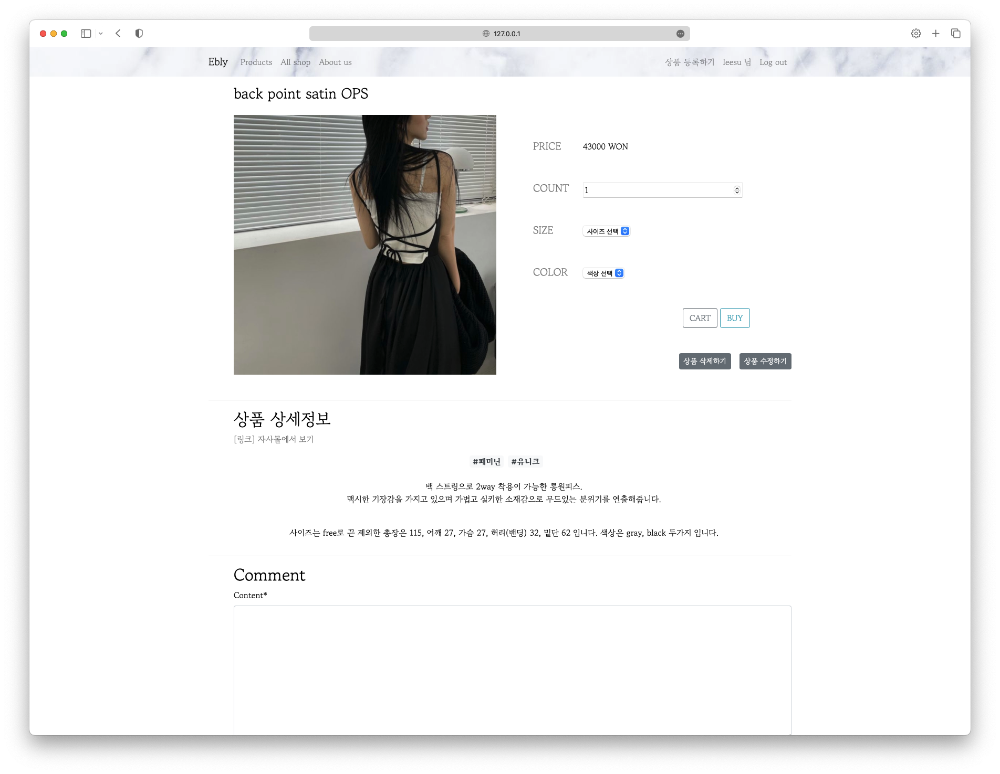
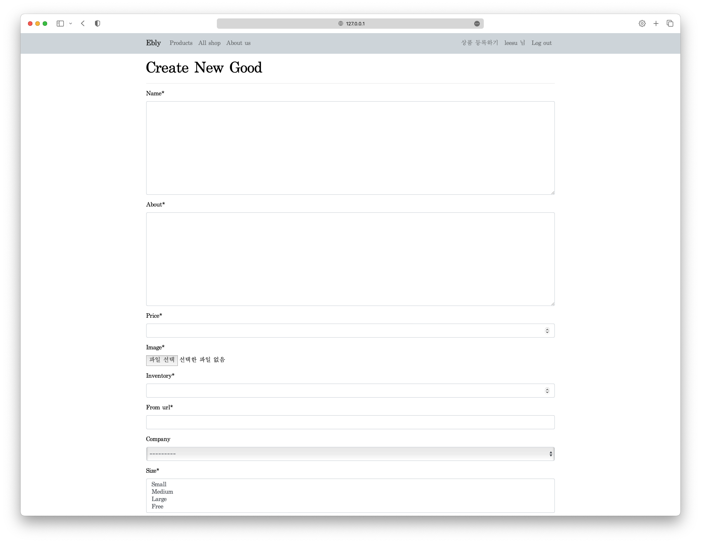
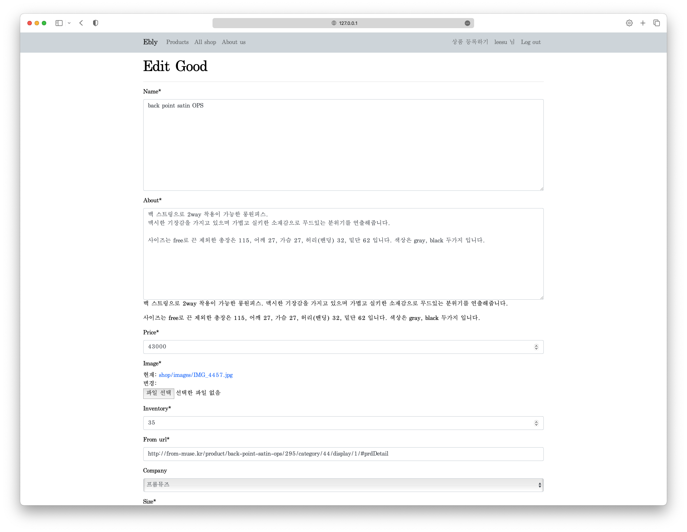
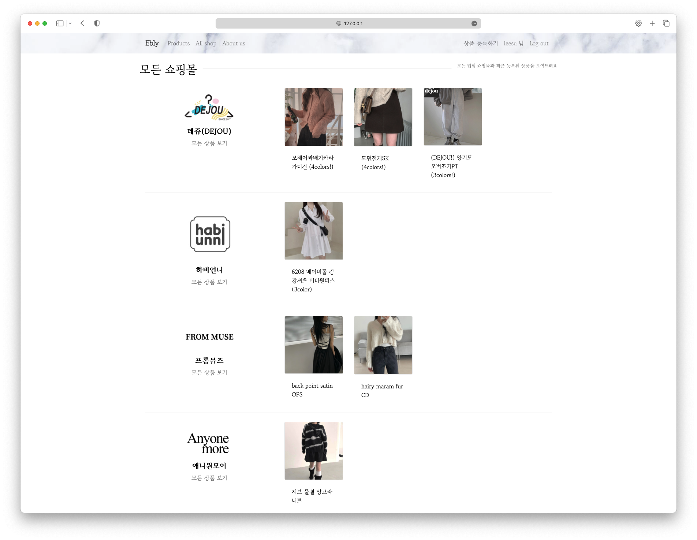
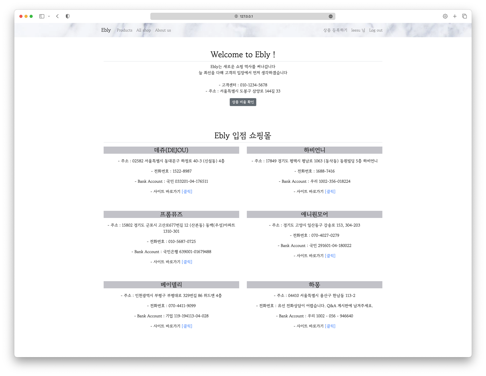
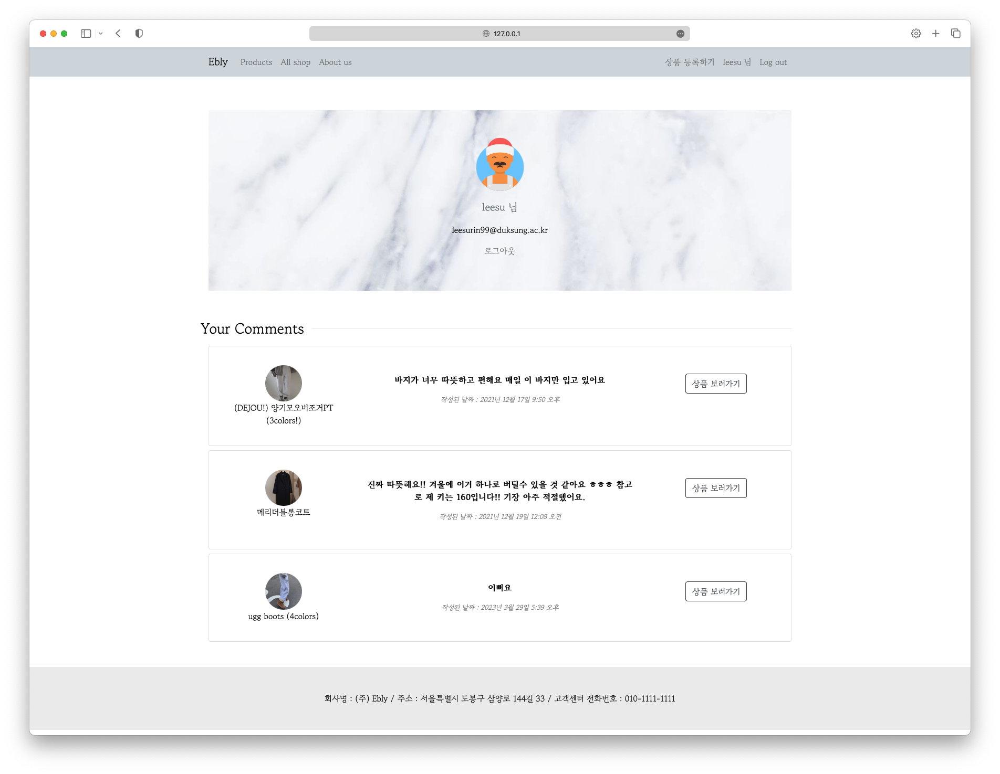

# django-shoppingMall
# Ebly

> ☁️ 쇼핑에 혁신을 가져온다 ! Welcome to Ebly!

# 프로젝트 소개

에이블리를 웹 서비스로 바꾸어 개발한 클론 프로젝트입니다.

## 프로젝트 주제 배경

PC로는 에이블리의 랜딩 페이지만 접근이 가능한 것이 개인적으로 굉장히 아쉬웠습니다. 그래서 웹으로도 이용이 가능한 에이블리를 만들어보고자 이 프로젝트를 진행하게 되었습니다.

## 프로젝트 설명

Django MTV 패턴을 사용하여 프론트와 백 모두 개인으로 개발하였습니다. 

프론트엔드는 BootStrap을 사용하였으며, 기본으로 제공되는 레이어 등을 활용하여 원하는 형태로 변형하여 사용하는 형식으로 구현하였습니다.

백엔드는 Django의 MTV 패턴으로 다양한 View 메소드 또는 클래스들을 정의하였습니다.

입접된 쇼핑몰의 직원일 경우 권한을 다르게 부여하여 상품 등록이 가능하게 하였고, 일반 손님과 나누어 사용됩니다. 권한 부여의 경우, 회사 내에 권한 관리를 따로 할 수 있는 것으로 두고 (admin 페이지에서 권한 수정 가능) 회원 가입 시에 권한 부여가 자동으로 이루어지도록 구현해두지는 않았습니다.

allauth를 사용하여 구글 및 카카오로 회원가입, 로그인이 가능합니다.

## 사용한 스택

- Python, Django
- BootStrap, CSS
- Django-allauth, SQLite

## 프로젝트 실행 방법

전체 소스 코드를 다운 받으신 후 프로젝트 폴더 위치의 터미널에서 다음을 순서대로 실행시키면 `127.0.0.1` 로 로컬에서 접속 가능합니다. (맥 터미널 기준 방법입니다)

```bash
(sudo) source venv/bin/activate
```

```bash
pip install -r requirements.txt
```

```bash
python manage.py runserver
```

# 프로젝트 결과

## 🖥️ 홈페이지



### 설명

- 가장 최근에 올라온 세 가지 상품을 바로 볼 수 있습니다.
- 상단의 Nav 바에서 모든 상품을 보러가거나 서비스의 설명, 그리고 로그인이 가능하도록 기능을 배치하였습니다.

## 🖥️ 상품 전체 페이지



### 설명

- 모든 상품을 볼 수 있는 페이지입니다.

### 품절 상태

- 상품은 등록할 때 재고 정보를 받아오며, 재고가 없을 경우 품절 상태를 확인할 수 있도록 하였습니다.
    - 현재 주문하는 기능이 없기 때문에 주문이 생성될 경우 재고에 적용되는 확장을 고려중에 있습니다.

### 상세 페이지 이동

- 구입하기 버튼을 통해 상품의 상세페이지로 이동할 수 있습니다.

### 필터링

- 서비스에 입점하고 있는 쇼핑몰별로 상품을 필터링 할 수 있습니다.
- 상품의 카테고리별로 상품을 필터링 할 수 있습니다.

### 검색

- 상품명, 카테고리, 쇼핑몰로 상품을 검색할 수 있습니다.

## 🖥️ 상품 상세 페이지



### 설명

- 상품의 상세 정보를 확인할 수 있는 페이지입니다.

### 상품 주문 폼

- 상품의 가격정보를 확인할 수 있습니다.
- 구매하고자 하는 수량과 색상, 사이즈를 선택할 수 있습니다.
    - 정해져 있는 값이 있는 사이즈, 색상은 드롭박스로 선택할 수 있도록 하였습니다.
- 주문과 장바구니 버튼이 있지만 현재 연결된 기능은 없습니다.

### 상품 상세 정보

- 상품 상세 정보는 등록 페이지에서 마크다운을 사용할 수 있도록 했습니다.
- 해당 상품의 자사몰 페이지로 이동할 수 있도록 링크를 연결해두었습니다.

### 댓글기능

- 상품에 대한 리뷰, 문의 등을 남길 수 있습니다.
- 로그인을 하지 않으면 보는 것만 가능하고 로그인을 했을 경우 댓글 작성이 가능합니다.

### 상품 수정 및 삭제 기능



- 해당 쇼핑몰의 스태프일 경우 상품 삭제와 수정 기능이 활성화되어 나타나도록 하였습니다.

## 🖥️ 상품 등록 및 수정 페이지





### 설명

- 스태프 권한을 가지고 있는 계정으로 로그인할 경우 상품을 등록하거나 수정할 수 있는 페이지로 접근할 수 있습니다.

## 모든 쇼핑몰 리스트 페이지



### 설명

- 서비스에 입접한 모든 쇼핑몰 정보를 볼 수 있습니다.
- 각 쇼핑몰 별로 세개의 상품을 미리 볼 수 있으며, 이 순서는 최신으로 등록된 상품 순으로 나오도록 구현하였습니다.
- 각 쇼핑몰의 모든 상품을 보러 갈 수 있도록 링크를 연결해두었습니다.

## 🖥️ 서비스 소개 페이지



### 설명

- Ebly 라는 서비스의 정보 페이지로, 입점한 쇼핑몰의 주소, 전화번호 등 기본 정보를 확인할 수 있도록 하였습니다.
- 각 쇼핑몰은 자사 사이트가 있을 경우 이동할 수 있도록 링크를 연결해두었습니다.

## 🖥️ 마이페이지



### 설명

- 자신이 작성한 댓글 내역을 볼 수 있습니다.
- 자신이 작성한 댓글의 상품으로 이동할 수 있도록 링크를 연결해두었습니다.